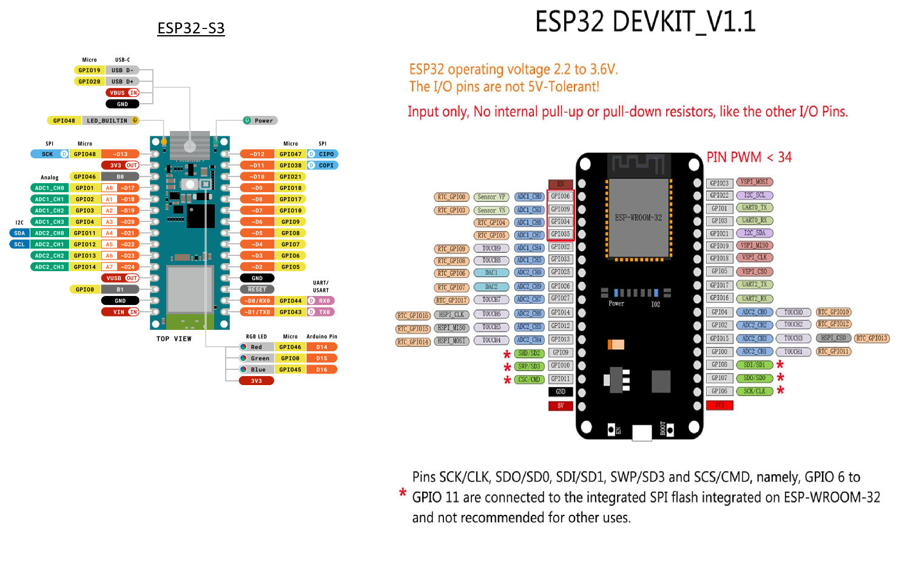

# Joy-Con → Hardware Keyboard (anti-cheat safe)

This workspace contains firmware for a **two-chip adapter**:

- **ESP32 (Classic BT capable)** connects wirelessly to a Joy-Con and outputs a small, fixed **UART protocol**.
- **ESP32-S3 (e.g. Arduino Nano ESP32-S3)** receives UART and exposes a **USB HID keyboard** to the PC.
  - It also exposes a **USB CDC-ACM serial (COM port)** for the `helper-app/` protocol.

If you have an Arduino Nano ESP32 (ABX00083): see `docs/arduino-nano-esp32-setup.md`.

Why two chips?
- Many boards that do USB HID well (ESP32-S3) don’t also do **Bluetooth Classic HID host** well.
- Joy-Cons commonly pair as **Bluetooth Classic HID** devices.

> Truth / constraint: Some online threads claim “Joy-Con uses BLE so an ESP32-S3 can do everything in one chip”. I can’t rely on that without evidence. This repo targets an ESP32 variant that supports **Bluetooth Classic** for the Joy-Con side.

If you want to try a **one-chip ESP32-S3-only** build anyway, first prove that your controller exposes **BLE HID over GATT**: see `docs/ble-hid-check.md`. If it cannot, the two-chip design here is the practical route.

Before buying parts, read `docs/board-checklist.md`.

## Folder layout

- `firmware/esp32-hid-host-uart/` — ESP32 firmware (HID host → UART)
- `firmware/esp32s3-usb-kbd/` — ESP32-S3 firmware (USB HID keyboard + CDC serial)
- `tools/` — optional offline helpers (log decoding)
- `helper-app/` — optional PC helper (serial UI for profiles/logs)
- `docs/` — wiring + notes

## Hardware assumptions (default)

- Joy-Con connects **wirelessly** to ESP32 over Bluetooth.
- Adapter connects to PC via **one USB cable** (ESP32-S3 → PC). This is what makes the PC see a normal hardware keyboard.

## CI bundle

Pushes to `main` can produce a single downloadable GitHub Actions artifact containing:

- both firmware build outputs (ESP32 Classic-BT host and ESP32-S3 USB keyboard)
- a packaged Windows helper app executable

The workflow definition lives in `.github/workflows/build-release-bundle.yml`.

Versioning is automatic:

- `version.json` is bumped by the local pre-commit hook, so each new commit advances the repo version.
- CI appends the GitHub Actions run number for push/build outputs, so artifact and packaged `.exe` versions also advance on each push.
- To **create a GitHub Release**, trigger the workflow manually with `create_release: true`.  The workflow validates that the version strictly increments over the last release, creates a tag, and uploads `JoyConBridgeHelper.exe` as a downloadable release asset.
- The helper app **auto-updates**: on startup it checks the latest GitHub Release and prompts the user to install newer versions.
- **Firmware OTA updates**: the helper app can also flash new firmware to both boards (ESP32-S3 and ESP32) over USB serial, downloading binaries from GitHub Releases. Both boards use an A/B OTA partition layout for safe rollback.

## Next

0) Wiring (one USB dongle): see `docs/wiring.md`
1) Firmware install / flashing (Windows): see `docs/firmware-install.md`
2) Build and flash ESP32-S3 firmware: see `firmware/esp32s3-usb-kbd/README.md`
3) Build and flash ESP32 firmware: see `firmware/esp32-hid-host-uart/README.md`
4) Edit key mapping in `docs/keymap.md` (then update the ESP32 mapping table)
5) Use the helper app's **Bind key** feature to remap any controller button to any keyboard key (see `docs/keymap.md` / `remap_hid`)
6) Define up to 4 **layers** for alternate mappings activated by a controller button (see `helper-app/protocol.md`)
